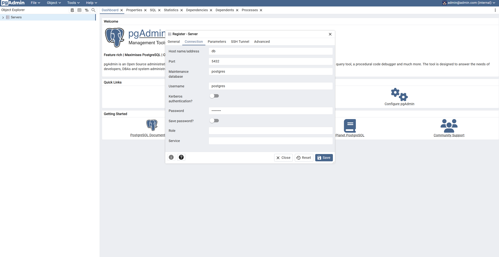
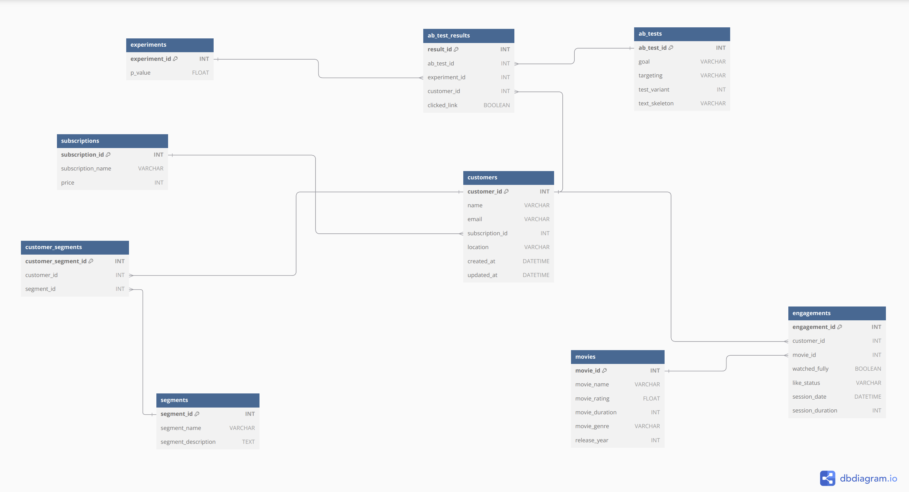
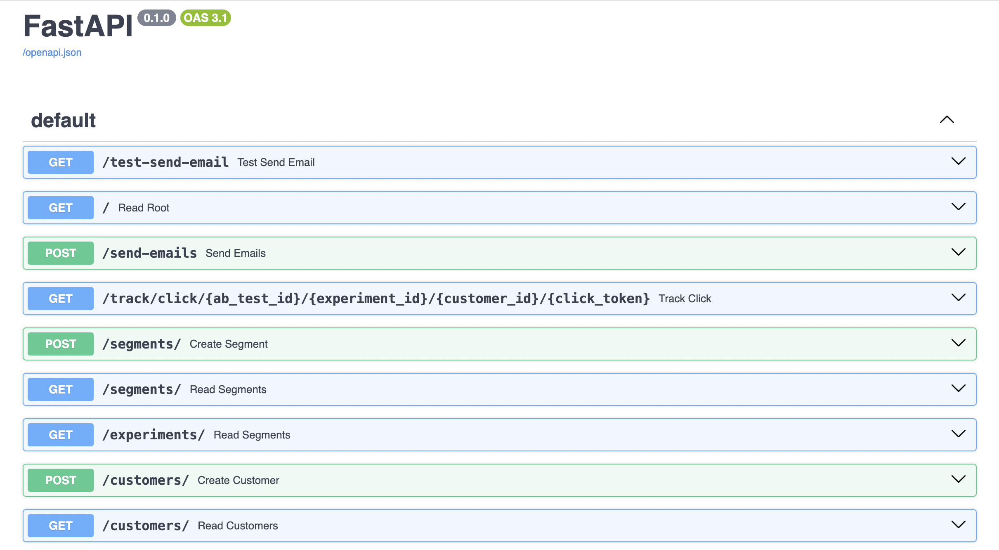
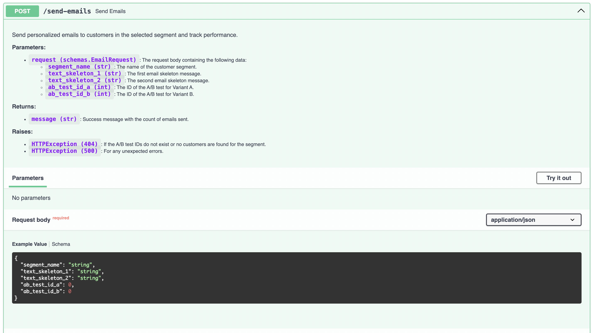
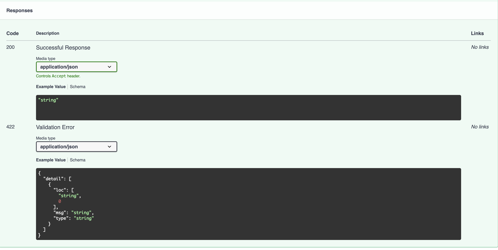
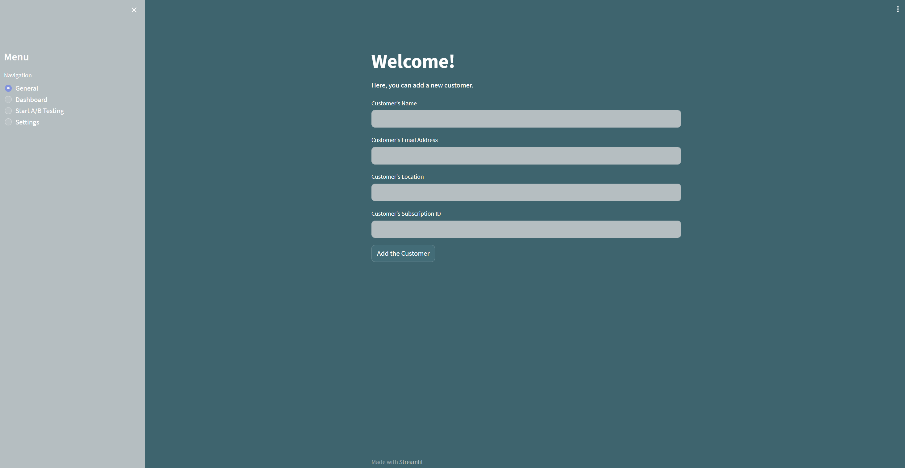
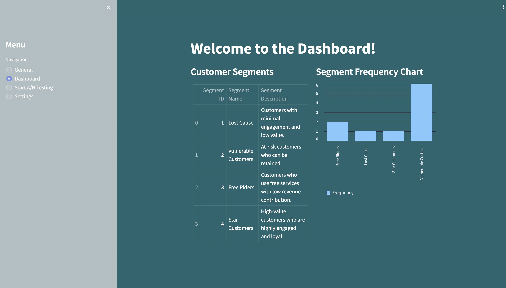
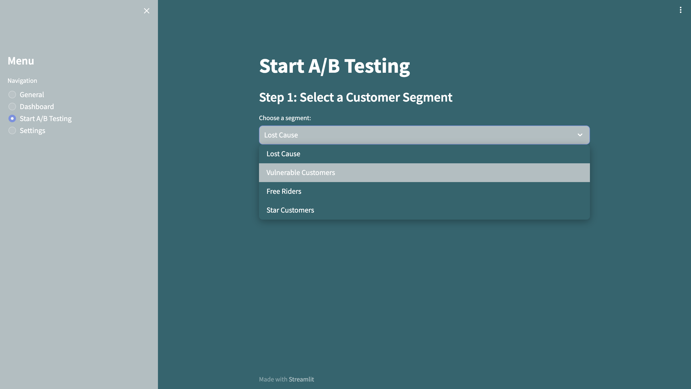
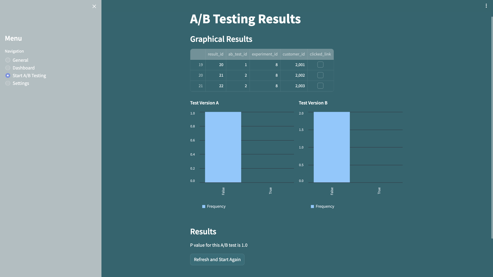
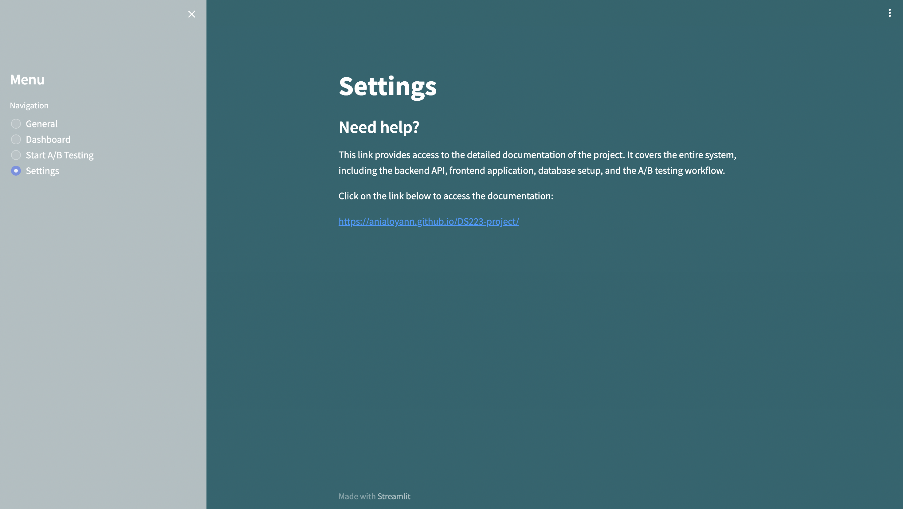

# Dockerized ETL, PostgreSQL, and pgAdmin Setup

## Official Documentation

**Follow to [this](https://anialoyann.github.io/DS223-project/) link.**

## Installation

Before getting started, ensure you have the following prerequisites installed:

1. Clone the repository:
   ```bash
   git clone https://github.com/anialoyann/DS223-project.git
   ```

2. Build and start the Docker containers (inside a virtual environment, of course):
   ```bash
   docker-compose up --build
   ```

## Access the Application

After running `docker-compose up --build`, you can access each component of the application at the following URLs:

- **Streamlit Frontend**: [http://localhost:8501](http://localhost:8501)  
  The main interface for managing customers, built with Streamlit. Use this to add customers, see the Dashboard and run the A/B Test to send the emails and see the results.

- **FastAPI Backend**: [http://localhost:8000](http://localhost:8000)  
  The backend API where requests are processed. You can use tools like [Swagger UI](http://localhost:8000/docs) (provided by FastAPI) to explore the API endpoints and their details.

- **PgAdmin** (optional): [http://localhost:5050](http://localhost:5050)  
  A graphical tool for PostgreSQL, which allows you to view and manage the database. Login using the credentials set in the `.env` file:
  
  - **Email**: Value of `PGADMIN_EMAIL` in your `.env` file
  - **Password**: Value of `PGADMIN_PASSWORD` in your `.env` file

> Note: Ensure Docker is running, and all environment variables in `.env` are correctly configured before accessing these URLs.

## Project Structure

Here’s an overview of the project’s file structure:

```bash
├── LICENSE
├── README.md
├── mkdocs.yml
├── applications
│   ├── .env                 # Environment variables for the entire application
│   ├── app                  # Streamlit frontend folder
│   │   ├── Dockerfile       # Dockerfile for Streamlit container
│   │   ├── __init__.py
│   │   ├── app.py           # Streamlit main entry point
│   │   └── requirements.txt # Frontend dependencies
│   ├── back                 # FastAPI backend folder
│   │   ├── Dockerfile       # Dockerfile for FastAPI container
│   │   ├── __init__.py      # Marks this directory as a package
│   │   ├── main.py          # FastAPI main entry point
│   │   ├── database1.py     # Database configuration and connection
│   │   ├── email_utils.py   # Email sending functionality
│   │   ├── models1.py       # SQLAlchemy models for database tables
│   │   ├── schema1.py       # Pydantic schemas for request and response validation
│   │   └── requirements.txt # Backend dependencies
│   ├── ds                   # Data Scientist's folder
│   │   ├── __init__.py
│   │   ├── ab_testing.py    # Model for A/B Testing
│   │   ├── Dockerfile       # Dockerfile for the DS container
│   │   ├── ds_model.py      # Model for customer segmentation
│   │   ├── requirements.txt # Requirements for DS
│   │   └── test.ipynb       # Notebook for executing the models
│   ├── etl                  # ETL process folder
│   │   ├── data             # Data folder for ETL inputs
│   │   ├── data_generator.py # Code function generating fake data using database structure
│   │   ├── database.py      # Database configuration and connection
│   │   ├── db_utils.py      # Useful functio for DB (just in case)
│   │   ├── Dockerfile       # Dockerfile for  container
│   │   ├── etl.py           # Python code for creating the data tables and uploading them into the DB
│   │   ├── models.py        # SQLAlchemy models for database tables
│   │   └── requirements.txt
└── docs                     # Documentation assets
    ├── etl.md               # Describes the ETL process
    ├── app.md               # Overview of the application
    ├── api.md               # Documentation for the API endpoints
    ├── index.md             # Documentation home page
    └── imgs                 # Contains all image files
```


## Docker 

This repository sets up a Docker environment with five main services:

1. **PostgreSQL:** for data storage
2. **pgAdmin:** for database management and visualization
3. **ETL:** service for Extract, Transform, Load (ETL) operations using Python
4. **API:** service for succcessfully connecting endpoints and performing CRUD operations
5. **APP** service for UI

## Prerequisites

Before running this setup, ensure Docker and Docker Compose are installed on your system, and docker is running.


- Docker: [Install Docker](https://docs.docker.com/get-docker/)
- Docker Compose: [Install Docker Compose](https://docs.docker.com/compose/install/)


## DB

- Access pgAdmin for PostgreSQL management: [http://localhost:5050](http://localhost:5050)
    - username: admin@admin.com 
    - password: admin
    - When running for the first time, you must create a server. Configure it as shown in the below image (Password is blurred it should be `password`.)
    

### Environment Variables

Make sure to have a `.env` file in the root directory to define your environment variables as below:

```env
# PostgreSQL configuration
DB_USER=<your_database_user>
DB_PASSWORD=<your_database_password>
DB_NAME=<your_database_name>

# pgAdmin configuration
PGADMIN_EMAIL=<your_pgadmin_email>
PGADMIN_PASSWORD=<your_pgadmin_password>
```


## ETL

### Schema Design

We will try to create the below schema:



### ETL

In `models.py`, we have used the `sqlalchemy` package, which allows to map python objects with SQL objects.

By running `etl.py` the following objects will be created:
    - sql tables 
    - the data sets will store in the `data\` folder
    - the csv files will be loaded into DB

# A/B Testing and Customer Segmentation

This project implements **A/B Testing** and **Customer Segmentation** to analyze user behavior and optimize campaigns. The workflow includes deriving customer engagement statistics based on which the segmentation can be calculated for each customer, performing A/B tests (by sending out emails to users), and using statistical analysis to interpret the results.

## Customer Segmentation (`ds_model.py`)

The **Customer Segmentation** script segments customers into different groups based on various metrics. Customers are assigned to different segments based on a scoring system, which helps in targeting the right group for specific campaigns.

- **Process**:
  - Aggregates engagement metrics like session frequency, total watch duration, and engagement actions (liked, disliked, etc.).
  - Calculates additional metrics:
    - **Recency**: Time elapsed since the customer's last session.
    - **Monetary**: Derived from subscription price.
  - Assigns scores to customers based on predefined thresholds for:
    - **Frequency of interactions**
    - **Duration of sessions**
    - **Monetary value**
    - **Liked and disliked interactions**
  - Computes a **total score** to classify customers into four segments:
    - **Lost Cause**: Low engagement and value.
    - **Vulnerable Customers**: At risk but have some engagement.
    - **Free Riders**: Regularly interact but offer minimal monetary value.
    - **Star Customers**: High engagement and monetary value.
  - Stores the customer segments into a database for future analysis.


## **A/B Testing Script(`ab_testing.py`)**

### **Workflow**
1. Select a **segment** and **goal** (e.g., "subscription").
2. Fetch customers in the segment and test variants related to the goal.
3. Calculate click rates for Variant 1 and Variant 2.
4. Perform a Chi-Square Test for statistical significance.
5. Store results in the database and report the better-performing variant if significant.


## API
This is the main interface where all the available API endpoints are listed.



#### 2. **Endpoint Details**
Here’s an example of one of the API endpoints, showing parameters and responses for interacting with the system.



You can interact with the API through this UI, send test requests, and review the responses. This makes it easier to test and troubleshoot the API directly in the browser.

### Features

- **Send Test Email**: Sends a test email to a predefined recipient for testing purposes.
- **Send Personalized Emails**: Sends personalized emails to customers within a specific segment and tracks their interactions. Includes support for A/B testing.
- **Track Clicks**: Tracks click events for customers in A/B tests to analyze engagement.
- **Create Segment**: Adds a new customer segment to the system, which can be used for targeted email campaigns.
- **Customers**: Adds new customers, retrieves a list of customers, and associates them with segments.
- **Customer Segments**: Allows the creation and retrieval of customer segments.
- **Movies**: Adds movies to the database and retrieves a list of movies.
- **Engagement Records**: Tracks customer engagement with movies, including watch status and like status.
- **Subscriptions**: Creates and retrieves subscription records.
- **A/B Tests**: Defines A/B tests, tracks their results, and sends corresponding emails to customers.


In this folder you can find the codes that connects endpoints with the DB you can insert, delete, updated, and check employee with there id's.

### Requests

- `POST /customers/`: Add a new customer.
- `POST /send-emails`: Send personalized emails to customers within a selected segment and track their interactions.
- `GET /segments/`: Retrieve a list of customer segments with pagination.
- `GET /customer_segments/`: Retrieve a list of customer segments with pagination.
- `POST /movies/`: Add a new movie to the database.
- `GET /movies/`: Retrieve a list of movies with pagination.
- `POST /ab_tests/`: Create a new A/B test record.
- `GET /ab_tests/`: Retrieve a list of A/B test records.
- `GET /ab_test_results/`: Retrieve a list of A/B test results.


#### 3. **API Responses**
This section provides a sample of the responses you can expect when interacting with the API endpoints.



In this example:
- **200** indicates a successful response.
- **422** indicates a validation error when the request parameters do not match the expected format.

## Web Application

We have another service named `app`, which is going to be responsible for the **front-end**.

To Open the web app visit: [here](http://localhost:8501/) 

The **Streamlit Front-End** application provides an interactive user interface that allows users to manage customer data, run A/B tests, and view results. The app is integrated with the **FastAPI Backend** to perform operations such as sending personalized emails, managing customer segments, and tracking customer engagement. The following features are available:

### Features

**Add New Customer:**
   - Users can add new customers by providing their **name**, **email**, **location**, and **subscription ID**.
   - The app sends the customer data to the backend API for storage in the database.

    
   *The user interface allows users to input the customer's name, email, location, and subscription ID. Upon submission, the details are sent to the backend for processing.*


**Dashboard:**
   - Displays a list of customer segments and their details.
   - Visual representation of customer engagement using a **bar chart** showing customer frequency within each segment.

     
   *The dashboard shows customer segments and the frequency of customers in each segment.*

**Start A/B Testing:**
   - Users can start an A/B test by selecting a **customer segment** and defining the **test goal** (e.g., **subscription** or **engagement**).
   - After defining the goal, the user proceeds to select a subscription package or engagement strategy.
   - The app sends test emails and tracks interactions for further analysis.

     
   *A/B testing interface allows users to select a segment and begin the testing process.*

**Send Personalized Emails:**
   - Personalized emails are sent to customers within a selected segment.
   - Includes **A/B testing** functionality where different emails are sent to different test groups.

**Customer Segmentation:**
   - Allows creation and management of customer segments based on engagement metrics like **recency**, **frequency**, **monetary value**, and **engagement** (e.g., likes/dislikes and watch completion).
   - Segments are used for targeted email campaigns.

**View A/B Test Results:**
   - Displays the results of the A/B tests.
   - Results are presented graphically, allowing users to analyze the performance of different campaigns.

     
   *Results screen shows graphical comparisons for Test Version A and Test Version B.*

**Settings:**
   - The settings page provides access to detailed documentation and other configuration options.

     
   *The settings interface includes a link to the project's detailed documentation.*

### How to Use

**Start A/B Test:**
   - Select a **customer segment**.
   - Choose the **goal** of the test (e.g., **subscription** or **engagement**).
   - Select the **package type** or **engagement strategy**.
   - **Send emails** and track **customer interactions**.

**Add a Customer:**
   - Input customer details (name, email, location, subscription ID) and add them to the system.

**View Results:**
   - Check **A/B test results** with visual charts and detailed metrics.

The end.

Note: For more enjoyable content, do something else instead of reading README files (despite the name).